# DunderMifflin-WarehouseManagementSystem
A simple Warehouse Management System built to meet the needs of *the best paper company's*
warehouse. 🧻📦


## Getting Started

### Prerequisites
- Java 11
- Docker & Docker Compose

### Running Locally

1. Copy the example env file and set your JWT secret:
   ```bash
   cp .env.example .env
   # edit .env and set JWT_SECRET=<your-secret>
   ```

2. Start all services:
   ```bash
   docker compose up --build
   ```

| Service             | URL                        |
|---------------------|----------------------------|
| App (REST API)      | http://localhost:8080      |
| Mongo Express       | http://localhost:8081      |
| RabbitMQ Management | http://localhost:15672     |

---


## 🧱 Tech Stack

| Layer            | Technology                                  |
|------------------|---------------------------------------------|
| Language / Build | Java 11, Maven                              |
| Framework        | Spring Boot 2.7.x (Web, Data JPA, Security, AMQP, Data MongoDB) |
| Relational DB    | PostgreSQL (Employees, Clients, Addresses)  |
| Document DB      | MongoDB (Orders)                            |
| Messaging        | RabbitMQ                                    |
| Auth             | Spring Security + JJWT (HS256 JWT)          |
| Misc             | Lombok                                      |

---

## V2 — Microservices & Saga Pattern

In V2, the monolith will be **decomposed into independent microservices**, each owning its
own data store, and cross-service business processes (most importantly *order
fulfillment*) will be coordinated using the **Saga Orchestration pattern**.

RabbitMQ is the **transport layer** for all inter-service communication — both saga
commands/replies and domain event broadcasts. The coordination *logic* (who decides
what happens next) lives in the **`order-service` saga orchestrator**; RabbitMQ is
just the pipe it uses to reach other services.

### Saga Orchestration: Order Fulfillment

`order-service` owns the saga state machine. It issues directed **commands** to other
services and waits for **replies** — it is always in charge of the next step.

```
order-service ──[ValidateClientCommand]──► client-service
order-service ◄──[ClientValidatedEvent]── client-service
      │
      ▼
order-service ──[ReserveStockCommand]────► inventory-service
order-service ◄──[StockReservedEvent]──── inventory-service
      │
      ▼
order-service ──[ScheduleDeliveryCommand]► shipping-service
order-service ◄──[DeliveryScheduledEvent] shipping-service
      │
      ▼
order-service ──[OrderConfirmedEvent]────► notification-service (fan-out)
```

On any failure, the orchestrator issues **compensating commands** in reverse order
(e.g. `ReleaseStockCommand`, `CancelOrderCommand`) before marking the saga `COMPENSATED`.

`DeliveryStatus` gains two saga lifecycle states: `PENDING` (created, awaiting
validation) and `CANCELLED` (compensation applied).

A `SagaState` document (MongoDB, owned by `order-service`) records the current step,
status (`STARTED | COMPLETED | COMPENSATED | FAILED`), and failure reason for every
in-flight saga.

### V2 Tasks

- [ ] **Service decomposition**
  - [ ] `auth-service` — JWT issuance, user lookup, role management; downstream services
    validate tokens from claims only (shared secret, no DB call)
  - [ ] `client-service` — clients & addresses (PostgreSQL); consumes `ValidateClientCommand`,
    publishes `ClientValidatedEvent` / `ClientValidationFailedEvent`
  - [ ] `employee-service` — employees & roles (PostgreSQL)
  - [ ] `order-service` — orders (MongoDB); **Saga orchestrator**; owns `SagaState` and
    `ClientLocationCache` collections
  - [ ] `inventory-service` — stock reservations (PostgreSQL); consumes `ReserveStockCommand`,
    publishes `StockReservedEvent` / `StockUnavailableEvent`
  - [ ] `shipping-service` — delivery scheduling & status (PostgreSQL); consumes
    `ScheduleDeliveryCommand`, publishes `DeliveryScheduledEvent`
  - [ ] `notification-service` — fan-out consumer only; no HTTP endpoints, no database;
    listens to `order.confirmed`, `order.cancelled`, `order.status.updated`
  - [ ] `api-gateway` — Spring Cloud Gateway, JWT signature validation, routing
- [ ] **Service infrastructure**
  - [ ] Service discovery (Eureka or Consul)
  - [ ] Centralized config (Spring Cloud Config)
  - [ ] Per-service Dockerfiles + extended `docker-compose.yaml`
  - [ ] Distributed tracing (Sleuth + Zipkin) and centralized logging
  - [ ] Per-service health checks & metrics (Actuator + Prometheus/Grafana)
- [ ] **Inter-service communication**
  - [ ] Upgrade RabbitMQ from `DirectExchange` to `TopicExchange` (`wh.topic.exchange`)
    to support both directed commands and fan-out events on the same broker
  - [ ] Saga commands/replies on dedicated queues (e.g. `saga.validate-client.queue`,
    `saga.client-validated.queue`) — point-to-point, consumed only by the orchestrator
    or the target service
  - [ ] Domain events on broadcast queues (e.g. `order.confirmed.queue`) — multiple
    services can bind and consume independently
  - [ ] Dead Letter Exchange (`wh.dlx.exchange` → `wh.dead-letter.queue`) on all saga
    queues to catch unprocessable messages
  - [ ] Internal service-to-service REST calls (e.g. `GET /internal/clients/{id}/exists`)
    protected by `X-Internal-Key` header, not by JWT
  - [ ] Versioned event payloads (schema in a shared `contracts` module)


### Diagram


